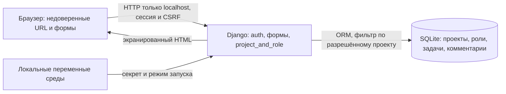

# Проект: TaskFlow, планируемый выпуск v1.0.0

Рабочая редакция концепции для ЭК1, 04.10.2026. Материалы подготовлены по [текущим правилам курса](https://github.com/hse-rbpo-master-2026/course/tree/5ce5fdf4ba4bb32ac62d1b9c6728f3a6d8fa6884). В документе описаны границы нашего продукта, исходное состояние и план безопасной разработки. Выполненные проверки отделены от дальнейшего плана. Методологическая основа — NIST SSDF 1.1 с выбранными техническими требованиями OWASP ASVS 5.0.0. Персональный [план проверок](docs/work-plan.md) определяет исполнителей, взаимную проверку и сохраняемые результаты.

## 1. Паспорт проекта

| Поле | Значение |
| --- | --- |
| Команда | ЯвкаИБ |
| Участники | Бекетов Роман Александрович — [rbeketov](https://github.com/rbeketov); Кузьмин Ярослав Артёмович — [yarikTri](https://github.com/yarikTri) |
| Учебные адреса для ЭИОС | Бекетов Роман Александрович — rabeketov@edu.hse.ru; Кузьмин Ярослав Артёмович — yakuzmin@edu.hse.ru |
| Продукт | TaskFlow: локальный веб-трекер проектов, задач и текстовых комментариев с ролями внутри проекта |
| Планируемый выпуск | `v1.0.0`: учебный локальный выпуск с обоснованным решением о допустимости использования |
| Исходное состояние продукта | [`baseline-mvp`](https://github.com/rbeketov/rbpo-yavkaib/tree/baseline-mvp), commit [`39cfbe71e5960ef8c4b7637d769444d34c94d260`](https://github.com/rbeketov/rbpo-yavkaib/commit/39cfbe71e5960ef8c4b7637d769444d34c94d260) |
| Комплект ЭК1 | Тег `ek1`; это комплект для оценивания, не продуктовый выпуск |
| Репозиторий | https://github.com/rbeketov/rbpo-yavkaib |

**Исходная версия.** В качестве baseline используем первый работающий MVP. До него в репозитории находились только документы; отдельной промышленной версии не было. Имеющиеся тесты входят в исходное состояние. Последующее улучшение будем оценивать относительно этой версии. Код продукта в комплекте ЭК1 совпадает с baseline; контрольные суммы приведены в [verification.json](evidence/ek1/verification.json). После baseline добавлены концепция, правила работы и CI.

### Объект проверки и условия применения

Вывод о безопасности относится к конкретной версии, конфигурации и сценарию использования. Для TaskFlow фиксируем следующие условия:

| Что фиксируем | Наше решение и основание |
| --- | --- |
| Исследуемая версия | Код `baseline-mvp`, commit `39cfbe71e5960ef8c4b7637d769444d34c94d260`; исходники идентифицируются также по SHA-256 в отчёте |
| Планируемый продуктовый выпуск | `v1.0.0`; окончательный commit будет выбран после проверок и улучшения. Тег `ek1` обозначает комплект первой защиты |
| Среда | Доверенный учебный компьютер, Python 3.12, локальный Django и SQLite, адрес `127.0.0.1:8000`; без публичного хостинга |
| Конфигурация демонстрации | Явный `DEBUG=1`, локальный HTTP, случайный секрет в `.env`; параметры установки и запуска приведены в README |
| Данные и доступ | Синтетические пользователи, проекты, задачи и комментарии; роли привязаны к проекту. Оператор компьютера имеет доступ к файлам и считается доверенным |
| Сценарий | Владелец создаёт проект и назначает участников; редактор работает с задачами; наблюдатель читает; посторонний не получает содержимое проекта |
| Основание выводов | Идентификатор кода, зависимости, параметры проверки, входные данные, фактический результат и ограничения метода |
| Условия пересмотра | Изменение прав, сессий, форм, пакетов или конфигурации требует пересмотреть затронутые проверки. Публичный доступ, реальные данные и новые интеграции требуют пересмотреть саму область исследования |

**Проверяемые обещания продукта.** P1 — посторонний не читает и не изменяет чужой проект; P2 — наблюдатель не изменяет данные; P3 — состав участников и удаление контролирует владелец; P4 — пользовательский текст отображается безопасно, изменяющие запросы проходят CSRF-проверку; P5 — проверенный код и состав зависимостей можно воспроизвести из фиксированной версии.

Эти обещания задают критерии будущих проверок. Существующие результаты показывают поведение только в указанной области; вывод о готовности к публичной эксплуатации из них не следует.

### Контекст и пользователи

Наша команда состоит из двух студентов. TaskFlow предназначен для небольшой учебной команды; для демонстрации используем синтетические аккаунты. Основное требование к продукту: пользователи работают только с разрешёнными проектами, а наблюдатель не изменяет данные. Пользователь может владеть одним проектом и читать другой. Доступ администратора ОС к файлу SQLite находится вне этой модели.

Для будущего продуктового выпуска планируем совместное решение двух участников на основании результатов проверок (§4). Небольшой объём трекера и три роли позволяют сосредоточиться на контроле доступа и проверяемости выпуска.

| Действие | Владелец | Редактор | Наблюдатель | Вне проекта |
| --- | --- | --- | --- | --- |
| Читать проект, задачи и комментарии | Да | Да | Да | Нет |
| Создавать/изменять задачи, писать комментарии | Да | Да | Нет | Нет |
| Удалять задачу или проект | Да | Нет | Нет | Нет |
| Управлять участниками и их ролями | Да | Нет | Нет | Нет |

Любой аутентифицированный пользователь может создать свой проект. Владелец назначается сервером и не меняется через формы. Роли editor/viewer хранятся в Membership; owner — в Project. Отзыв членства действует со следующего запроса. Superuser не получает глобального доступа через веб-приложение.

### Границы

**Входит:** локальное создание demo-пользователей; вход/выход; создание и удаление проектов; управление составом владельцем; задачи с названием, описанием и статусом todo/doing/done; текстовые комментарии; серверное разграничение доступа; миграции, инструкции и воспроизводимые проверки.

**Не входит:** промышленный хостинг, реальная многопользовательская эксплуатация, регистрация и восстановление пароля, SSO, почта, мобильный клиент, SPA, вложения, уведомления, интеграции и внешнее API. Не исследуются производственная инфраструктура, нагрузка и защита от администратора ОС. Для показа используются только синтетические данные.

### Компоненты, взаимодействия и границы доверия

Стек: Python **3.12.14**, Django **5.2.17**, SQLite из Python, серверные HTML-шаблоны и локальный CSS; asgiref **3.12.1**, sqlparse **0.6.0**. Версии пакетов фиксируются в [requirements.txt](requirements.txt), схема данных — в [миграции](tracker/migrations/0001_initial.py).

1. **Браузер → сервер:** подмена URL/полей допустима как угроза. Сервер проверяет вход, членство и роль; ID объекта сам по себе права не даёт. Задача ищется внутри уже разрешённого проекта.
2. **Пользовательский текст → HTML:** Django экранирует названия, описания и комментарии. HTML пользователя не считается доверенным. Поля имеют ограничения длины.
3. **Сервер → данные:** запись через ORM и ограниченный набор полей формы. `owner`, `created_by`, `author`, `project` задаются сервером, а не принимаются из POST.
4. **Среда запуска → процесс:** секрет создаётся локально, не хранится в Git. SQLite и `.env` доступны доверенному оператору компьютера. `DEBUG=1` и HTTP используются только на loopback; production-проверка настроек не заменяет реального развёртывания.
5. **Поставка → окружение:** зависимости скачиваются с PyPI при установке; действия GitHub запускают CI. Во время работы приложения внешние сервисы не нужны.

### Активы и существенные риски

| ID | Актив и возможное нарушение | Значимость и граница | Направление проверки |
| --- | --- | --- | --- |
| R1 | Чужие проекты/задачи/комментарии читаются или меняются через подмену ID | Высокая: нарушено основное обещание изоляции, даже на синтетических данных | Серверная матрица прав, чужой project/task/membership ID |
| R2 | Редактор/наблюдатель меняет роли, владельца или сохраняет доступ после отзыва | Высокая: потеря контроля владельцем | Запретные POST, подмена полей, отзыв и понижение роли |
| R3 | CSRF либо скрипт в тексте вызывает действия от имени пользователя | Высокая при наличии рабочей сессии | Реальная CSRF-проверка, экранирование, безопасные методы |
| R4 | Проверен один код, а представлен другой; зависимости невозможно воспроизвести или не оценены их известные дефекты | Средняя для локального выпуска: результаты не обосновывают поставляемую версию | Зафиксированные версии, SHA-256, архив тега, анализ зависимостей |

Это гипотезы риска, а не заявления о найденных уязвимостях. Отсутствие ограничения частоты входа и защита локальных файлов — известные ограничения. Выход за localhost потребует пересмотра границ и блокирует применение текущего решения о локальном выпуске.

### Доступные материалы и ограничения

- [x] Исходный код, открытая Git-история и отдельный baseline.
- [x] Локальный запуск по [README](README.md), миграции и синтетические данные.
- [x] Зафиксированные зависимости и конфигурация через среду.
- [x] 27 автоматических тестов с подслучаями, сохранённый [отчёт](evidence/ek1/verification.json).
- [x] Возможность изменить код и повторить проверку.
- [x] Файл [CI](.github/workflows/ci.yml) в комплекте ЭК1; он запускает проверки. Обязательность статуса и branch protection не подтверждены.

**Недоступно/не исследовано:** промышленная среда, пользовательская статистика, внешние аудиты, закрытые обсуждения команды, история реальных релизов. Независимое воспроизведение партнёром пока не подтверждено.

**Конфиденциальность:** в приложении используются только синтетические аккаунты и тексты; `.env`, БД, cookie и пароли исключаются из публикации. ФИО и учебные адреса участников указаны в паспорте для оформления проекта по курсу.

**Выполнимость:** один сервер и БД; готовые механизмы Django; небольшой набор ролей. В рамках курса достаточно провести независимую проверку значимых сценариев, интерпретировать результаты, внести одно полезное улучшение и повторить проверку. Искусственное внесение уязвимости не требуется.

## 2. Методологическая основа

**Выбран вариант A:** NIST SSDF 1.1 — основная рамка процесса; OWASP ASVS 5.0.0 — дополнительный источник технических требований к веб-приложению. SSDF позволяет связать требования, review, тесты и решение о выпуске в процессе двух участников. ASVS конкретизирует проверки доступа, сессий и обработки ввода. Полное соответствие стандартам или уровень ASVS не заявляем.

### Что требуется от основы проекта

1. Охватывать разработку, проверку и решение о выпуске небольшого веб-приложения.
2. Позволять выбрать 5–7 применимых положений и реализовать их двумя участниками без вымышленных подразделений и полномочий.
3. Связывать права пользователей и другие свойства продукта с действиями, ответственностью и проверяемым результатом.
4. Иметь доступную точную редакцию источника; обязательные требования среды или преподавателя проверять независимо от выбора рамки.

### Сравнение кандидатов

Подробные карточки и короткий маршрут чтения — [Варианты методологии](docs/methodology-options.md). Здесь зафиксированы назначение источников и основание выбора.

| Источник и доступ | Для чего предназначен | Адаптация к TaskFlow и ограничения | Статус |
| --- | --- | --- | --- |
| [NIST SSDF 1.1](https://csrc.nist.gov/pubs/sp/800/218/final), открытый первоисточник | Практики безопасной разработки на всём жизненном цикле | Подходят требования, роли, review, тесты, защита кода, фиксация версии и реакция на дефекты. Нужны собственные критерии и способы проверки; готовой оценки зрелости нет | Выбран как основная рамка |
| [ГОСТ Р 56939-2024](https://protect.gost.ru/gost/details/f3818925-a96f-4f55-96e9-46b44720ee64), официальная карточка; назначенные положения — через ЭИОС/законный доступ | Требования к содержанию и порядку работ безопасной разработки | Нужно выбрать доступные применимые положения и соразмерно описать действия двух участников. Карточка каталога не заменяет текст требований; основание обязательности проверяется отдельно | Рассмотрен как альтернатива |
| [OWASP SAMM 2](https://owaspsamm.org/model/), открытая модель | Оценка состояния и развитие практик безопасности | Можно исследовать узкую область и определить путь улучшения. Для уровня зрелости нужны факты и критерии качества; короткая история проекта ограничивает выводы | Альтернатива с акцентом на зрелости процесса |
| [ISO/IEC 27034-1:2011](https://www.iso.org/standard/44378.html), открытая карточка, полный текст может требовать библиотечного доступа | Управление безопасностью приложений в организации | Полезен для отношений владельца, разработчика и поставщиков. В нашей паре организационный контекст проще; обзор не даёт готового компактного процесса | Сравнительный источник; избыточный организационный охват |
| [IEC 62443-4-1:2018](https://webstore.iec.ch/en/publication/33615), открытая карточка, полный текст может требовать доступа | Безопасный жизненный цикл продуктов промышленной автоматизации | TaskFlow не является промышленным продуктом. Общие полезные практики не делают отраслевую область применимой | Не подходит текущей области как основа |
| [OWASP ASVS 5.0.0](https://github.com/OWASP/ASVS/tree/v5.0.0), открытый первоисточник | Технические требования к веб-приложениям | Детализирует доступ, сессии и обработку ввода; не задаёт весь порядок разработки и полномочия выпуска | Выбран как дополнительный источник; уровень не заявлен |

**Почему выбрали A.** Для TaskFlow важнее установить выполнимые правила проверки и выпуска, чем оценивать зрелость короткой истории процесса. SSDF имеет открытый первоисточник, подходит обычному веб-продукту и допускает соразмерную адаптацию. SAMM полезен для последующей оценки устойчивости практик; для такой оценки нужны накопленные свидетельства. ГОСТ остаётся применимой альтернативой, но не даёт отдельного преимущества для выбранной учебной области. ASVS закрывает техническую детализацию, которой нет в SSDF. Выбор основан на применимости, а не на обещании оценки или сертификации.

### Перевод положения в выполнимое правило

Используем цепочку из Л02 и С03: **положение → применимость → действие → ответственный → результат → проверка и решение**. Ниже зафиксированы семь правил на основе SSDF 1.1. Это целевой порядок работы; фактическое выполнение подтверждается отдельными свидетельствами.

Названия ролей здесь обозначают функции: **автор** выполняет изменение, **проверяющий** — второй участник, **ответственный за комплект** готовит поставку. Персональные исполнители определены в §4–5 и [плане проверок](docs/work-plan.md). Самопроверка не считается независимым review.

| ID / положение | Применимость и связь с продуктом | Когда и что делаем | Кто выполняет → проверяет | Результат и критерий перехода |
| --- | --- | --- | --- | --- |
| A1 / **PO.1.2** — требования безопасности | Полностью для P1–P4: права должны быть однозначны | До изменения поведения описываем объект, роль, разрешённое действие и запрет; обновляем матрицу прав | Автор → второй участник | Матрица и сценарии связаны с изменением; у нового действия есть положительный и отрицательный критерии. При неясных правах сначала уточняем требование |
| A2 / **PO.2.1** — роли и ответственность | Полностью: два человека должны различать исполнение и проверку | При начале работы назначаем автора и другого проверяющего, указываем, кто принимает решение | Участники определяют роли → взаимно подтверждают | В Issue/PR видны исполнитель и reviewer; без назначенного и доступного проверяющего значимое изменение ждёт проверки |
| A3 / **PS.1.1** — защита кода и минимальные права | Частично: код публичный, важны целостность и защита секретов | При изменении доступа/CI и перед выпуском проверяем права, разрешения workflow и отсутствие секретов в комплекте | Владелец репозитория выполняет доступные проверки → второй участник сверяет | Запись о проверенных настройках и составе архива; `.env`, БД и секреты отсутствуют. Открытость кода допустима; недоступные настройки отмечаем как неизвестные |
| A4 / **PW.7.1–PW.7.2** — review/анализ кода | Полностью для затронутого кода: R1–R3 | Перед включением изменения второй участник читает проверку роли, выборку объекта и допустимые поля; замечания разбираются | Автор объясняет изменение → второй участник проводит review | Review относится к commit и называет просмотренный сценарий; неразобранное существенное замечание останавливает включение |
| A5 / **PW.8.1–PW.8.2** — проверка работающего кода | Частично: проверяем локальное приложение, без промышленной инфраструктуры | При изменении чувствительного поведения и перед выпуском выполняем выбранные положительные и отрицательные сценарии | Ведущий проверки → партнёр повторяет существенный случай | Версия, команда, вход и наблюдаемый результат сохранены. Например, запись от viewer отклонена и БД не изменилась; разрешённая запись editor работает |
| A6 / **PS.3.1** — сохранение выпуска и целостности | Частично: P5, небольшой локальный комплект | Перед передачей фиксируем commit/tag, собираем архив и его SHA-256; распаковываем в чистый каталог | Ответственный за комплект → второй участник | Файлы соответствуют тегу, установка и проверки повторяются. Расхождение версии или невозможность запуска блокирует передачу; корпоративного хранилища и подписанной цепочки поставки нет |
| A7 / **RV.2.1–RV.2.2** — анализ и устранение дефектов | Частично: учебный процесс без круглосуточной поддержки | При сигнале о проблеме определяем затронутую версию, применимость, влияние и следующее действие; после исправления повторяем проверку | Ведущий затронутой части → второй участник, решение о выпуске принимают оба | Карточка результата с основанием: подтверждён / ложное срабатывание / неприменимо / нужна проверка; исправление и повторный результат. Существенная неразобранная проблема блокирует продуктовый выпуск |

«Полностью» и «частично» характеризуют применимость положения к нашим границам, а не готовность исполнения. Упрощение масштаба должно сохранять смысл исходного положения.

**Пример A5 подробно.** Требование P2: наблюдатель может только читать. Перед принятием изменения прав отправляем запрос изменения задачи от viewer и такой же запрос от editor. Для viewer ожидаем отказ и неизменное состояние БД; для editor — разрешённое изменение. Сохраняем идентификатор кода, условия, команду и фактические результаты. Второй участник повторяет запрещённый сценарий и оставляет review. Если результат нарушает требование, исправляем код и повторяем проверку. Политика независимого review и конкретный способ запуска — наша адаптация к паре; они не выдаются за дословный текст SSDF.

Разрывы в §3 сопоставлены с этими правилами; §4 устанавливает контрольные точки, а §5 — способы получения свидетельств.

## 3. Текущее состояние

Срез на 04.10.2026: ожидания SSDF A4–A7 сопоставлены с исходниками, сохранёнными проверками и публичной историей репозитория.

### Основания и пределы наблюдения

Наблюдение выполнено 04.10.2026 по публичной Git-истории, исходникам и локальным запускам. Реестр — [evidence/ek1/README.md](evidence/ek1/README.md), машинный отчёт — [verification.json](evidence/ek1/verification.json), ограниченная выборка GitHub — [repository-observation.json](evidence/ek1/repository-observation.json).

| Объект | Что наблюдается | Что это не доказывает |
| --- | --- | --- |
| Два коммита до MVP | Паспорт и структура репозитория; приложения ещё не было | Нельзя восстановить закрытые обсуждения и устные проверки |
| `baseline-mvp` | Исходный код, миграция, инструкции и тесты | Наличие исходников и тестов не подтверждает независимый review |
| Серверные handlers и тесты | Проверяется членство/роль, задачи ограничены проектом; владельца/автора нельзя задать формой | Конечная выборка тестов не покрывает все сочетания и будущие изменения |
| Локальный verifier | 5 проверок успешны; 27 тестов с подслучаями успешны; версии/хеши сохранены | `pip check` не ищет CVE; `check --deploy` не проверяет реальный HTTPS/инфраструктуру |
| Браузерная проверка | Вход владельца, создание задачи, вход наблюдателя и режим чтения | Скриншот подтверждает интерфейс, а серверный запрет подтверждается тестами |
| [Публичный API после добавления CI](evidence/ek1/repository-observation-selected.json) | 4 завершённых успешных CI runs, 0 PR; последний проверенный commit `543a30f` | Успешный CI не подтверждает независимый review или обязательность статуса |
| Комплект ЭК1 после baseline | Добавлены концепция, workflow и правила дальнейшей работы | Наличие правил/CI-файла не означает, что два человека уже следовали им или настроен обязательный gate |

**Организация работы:** общий репозиторий `rbeketov/rbpo-yavkaib`; автор изменения и проверяющий — разные участники. Результаты фиксируются в PR, а персональные задания — в Issues.

### Существенные разрывы

**G1. Нет сохранённой независимой проверки MVP — высокий приоритет.**
Объект — модель ролей и изменения доступа; риск R1/R2. Тесты создавались в процессе реализации, без отдельной независимой проверки. Поэтому одна и та же ошибка может оказаться и в реализации, и в ожидаемом результате теста. В рассмотренных коммитах/PR нет проверяемого review партнёра. Это разрыв в основании решения, а не доказательство уязвимости или отсутствия любого чтения кода. Для закрытия: партнёр объясняет сценарий запрета, проверяет handler и повторяет его, оставляет review с конкретными ссылками. Целевое правило: GATE-M в §4.

**G2. Не оценена применимость известных дефектов зависимостей — средний приоритет.**
Версии зафиксированы, `pip check` проходит, но этот инструмент не выполняет аудит CVE. По рассмотренным материалам отчёта поиска и триажа нет. Не утверждается, что зависимость уязвима. R4 существенен, поскольку Django обслуживает вход и HTTP. Для закрытия: получить актуальный отчёт по точным версиям, разобрать применимость и сохранить решение, включая случай «ничего не найдено». Целевое правило: GATE-R, метод М3.

**G3. Воспроизводимость ещё не подтверждена вторым участником — средний приоритет.**
Автоматические проверки и упаковку можно выполнить на машине автора; это не подтверждает запуск в окружении партнёра и понимание параметров. Нет истории нескольких реально проверенных выпусков. R4: ошибка инструкции либо сбор не той версии может обесценить выводы. Для закрытия: второй участник распаковывает архив тега в чистый каталог, повторяет установку/проверки, сверяет commit и SHA-256. Проверенная упаковка частично снижает риск, но не заменяет независимый запуск. Целевое правило: GATE-R.

Отсутствие отдельного отдела ИБ, дорогих сканеров или большого числа документов не считается самостоятельным дефектом.

## 4. Целевой Secure SDLC

Целевой процесс основан на семи правилах SSDF из §2 и направлен на закрытие G1–G3. До продуктового `v1.0.0` выполняем независимый review и принимаем совместное решение о выпуске.

### Роли и полномочия

- **Роман Бекетов (rbeketov), ведущий М1/М3:** доступ, сессии, зависимости и сборка комплекта. Партнёр проверяет существенную часть результата.
- **Ярослав Кузьмин (yarikTri), ведущий М2:** задачи/комментарии, обработка ввода, пользовательские сценарии. rbeketov проверяет существенную часть результата.
- **Автор изменения:** пишет код/документ и собирает проверки; **reviewer:** другой участник, а не автор или ИИ. Для изменений партнёра роли меняются.
- **Оба:** принимают остаточный риск и решение о продуктовом выпуске. Административное право владельца нажать merge/tag не заменяет основание решения.

Персональные задания: [Issue Романа №1](https://github.com/rbeketov/rbpo-yavkaib/issues/1) и [Issue Ярослава №2](https://github.com/rbeketov/rbpo-yavkaib/issues/2). Критерии завершения приведены в [плане проверок](docs/work-plan.md). Взаимную проверку выполняет второй участник, а её результат сохраняется в review.

### Поток и контрольные точки

| Шаг / gate | Обязательное действие | Кто действует и проверяет | Сохраняемый результат | Условие перехода и отказа |
| --- | --- | --- | --- | --- |
| **GATE-S: границы** | Перед новым поведением указать затронутую роль, объект, риск, негативный сценарий | Автор → партнёр | Краткое описание в PR/issue, обновление §1 при смене границ | Нет понятного права/объекта — уточнить до реализации; новый внешний сервис/данные требуют пересмотра рисков |
| Реализация | Маленькая ветка, ограниченные поля, проверка прав на сервере, тест изменения | Автор | Diff, тесты, команды | Ошибка исправляется в ветке |
| **GATE-M: включение** | Verifier проходит; другой участник читает существенный код и повторяет хотя бы один запретный сценарий | Автор запускает → партнёр оставляет review | CI run для commit и review со ссылками/результатами | Красный/отсутствующий результат, неразобранное замечание или нет reviewer — merge откладывается |
| **GATE-R: выпуск** | Проверки commit, триаж значимых результатов, установка из архива, условия использования | Ведущий комплекта → партнёр воспроизводит; оба решают | Запись решения с рисками, tag/commit, checksum, отчёты | Непроверенная изоляция/права, применимая критическая проблема, секреты, неизвестная версия или нет второго решения — выпуск отложить |
| После выпуска | Принять сообщение, оценить применимость и охват, подготовить исправление | Ведущий компонента → партнёр, оба пересматривают решение | Карточка дефекта, исправление, повторный тест и новый тег | Старый тег не переставлять; опасную версию прекратить рекомендовать |

`CONTRIBUTING.md` реализует краткую памятку этих действий. CI запускает проверки, но обязательность статуса в настройках GitHub не подтверждена. Пока техническое принуждение не установлено, gate является правилом пары, а не гарантией платформы. Начальная подготовка непосредственно в `main` не выдаётся за прохождение будущего PR-процесса.

### Обязательный минимум и проверки по риску

**Для каждого продуктового выпуска:** неизменяемая идентификация версии; явная область использования; проверка ролей/изоляции и входа; отсутствие секретов в поставке; версии зависимостей и разбор результатов; независимый review; запуск из архива; решение обоих участников. При изменении только текста документа выполняется проверка смысла и ссылок, без бессмысленного повторения всех технических методов.

**По триггеру:** изменение доступа — вся матрица и отзыв ролей; новый ввод/вывод — XSS, длины, поля и CSRF; обновление пакетов — повтор М3 и регрессия; изменение конфигурации — проверка параметров/запуска; внешняя сеть, реальные данные, вложения или регистрация — пересмотр границ и дополнительный метод до выпуска. Сейчас публичный деплой не разрешён областью проекта.

### Исключения, принятие риска и эскалация

Некритическое отклонение оформляется одной карточкой: затронутая версия, требование, факт, влияние, компенсирующая мера, исполнитель, срок (до следующего выпуска, но не дольше семи дней) и явное согласие обоих. По окончании срока исключение закрывают исправлением и повторной проверкой либо выпуск откладывают; молчание не означает продление.

Нарушение изоляции/полномочий, опубликованный секрет, неустановленная версия, отсутствие второго проверяющего или непройденные базовые проверки не принимаются как исключение для `v1.0.0`. При недоступности партнёра автор готовит изменения и ждёт; самоодобрение и замена review ответом ИИ не допускаются. При споре сохраняют обе позиции, консультируются с преподавателем о границах курса и откладывают выпуск до общего обоснованного решения. Преподавателю не приписывается роль оператора продукта или автоматическое принятие риска.

После сообщения о возможной проблеме ведущий выполняет предварительный разбор в течение двух учебных дней; при риске доступа/секретов сначала прекращается распространение затронутой демонстрационной версии. Публичная карточка не должна содержать реальные секреты или данные. Затем — воспроизведение, решение о применимости, исправление, независимый review, регрессия, новый тег. Это целевой порядок, а не обещание круглосуточной поддержки.

### План до ЭК2

| Период | Результат и критерий завершения | Ответственный / оценка |
| --- | --- | --- |
| После ЭК1 и Л6–Л8 | Учесть замечания и уточнить М1–М3 по профильным занятиям | Оба; 1–2 совместных часа |
| С7–С8 | М1: независимые негативные сценарии; М2: ввод/вывод и CSRF; обмен review | Каждый ведущий 3–4 часа, партнёр 1–2 часа |
| С8–С9 | М3, триаж; одно полезное улучшение по фактам и повторный тест | rbeketov ведёт М3; улучшение распределяется по компоненту, 3–5 часов |
| До срока ЭК2 | Решение о выпуске, метрики, записка, личные страницы; архив проверен вторым участником | Оба; 2–3 часа |

Оценки времени — план, не табель выполненной работы. При нехватке времени сокращается число дополнительных методов и функций; независимый review и основания решения не исключаются.

## 5. Технологический профиль

**Предварительный план ЭК1.** Уточнить после Л6–Л8. Нет обязательства применить конкретный сканер или заявить полноценный аудит до изучения методов. Проверки, уже включённые в MVP, — доступная исходная опора, а не завершённая апробация обоими участниками.

### М1. Проверка серверного разграничения доступа

**Риски/цель:** R1/R2; подтвердить разрешения и отказы для всех трёх ролей и постороннего.

**Область:** все handlers [tracker/views.py](tracker/views.py), [permissions.py](tracker/permissions.py), отзыв/понижение роли, чужие ID, подмена автора/владельца, отсутствие обхода superuser.

**Этап:** требования → тесты при изменении → GATE-M/GATE-R.

**Способ:** Django TestCase/Client 5.2.17 и ручное чтение кода; [имеющиеся тесты](tracker/tests.py) доработать по независимым сценариям.

**Ведущий:** Роман Бекетов (rbeketov).

**Проверка партнёром:** yarikTri выбирает сценарий из матрицы без копирования готового теста, повторяет запрос, проверяет ответ и отсутствие изменения БД, затем оставляет review.

**Свидетельства:** точный commit, таблица входных условий/ожидаемых прав/фактических результатов, команды и существенный вывод теста, review.

**Ограничения:** не проверяет доверенного администратора БД, все конкурентные гонки или инфраструктуру; 403/404 без проверки состояния БД недостаточно.

### М2. Ввод, вывод и сессионные действия

**Риск/цель:** R3; текст остаётся текстом, запрос без CSRF-токена не меняет состояние, разрешённый сценарий продолжает работать.

**Область:** проекты/задачи/комментарии, серверные формы/шаблоны, вход/выход, пределы длины, GET без изменений.

**Этап:** разработка и review, GATE-M; регрессия перед GATE-R.

**Способ:** Django Client с `enforce_csrf_checks=True`, тесты экранирования и границ, ручной браузер. ASVS 5.0.0 используется как источник выбранных требований по вводу/выводу, сессиям и контролю доступа; точные пункты связываются со сценариями в отчёте М2. Полное соответствие и уровень ASVS не заявляются.

**Ведущий:** Ярослав Кузьмин (yarikTri).

**Проверка партнёром:** rbeketov повторяет отклонённый запрос без токена и успешный с токеном; проверяет опасный текст в DOM и факт отсутствия исполнения в браузере.

**Свидетельства:** пары положительных/отрицательных случаев, commit, вывод, только синтетические payload, небольшой скриншот при необходимости и review.

**Ограничения:** не полноценный XSS/DAST-аудит; конечный набор строк не покрывает все браузерные контексты; CSRF не защищает от уже исполняющегося XSS.

### М3. Зависимости, конфигурация и воспроизводимость поставки

**Риск/цель:** R4, G2/G3; знать состав и пределы проверенной версии, отдельно оценить известные дефекты.

**Область:** requirements, настройки Django, bootstrap, workflow, архив тега.

**Этап:** обновление зависимостей и GATE-R.

**Способ:** существующий verifier; `pip-audit` для поиска известных дефектов зависимостей с фиксацией версии инструмента и даты базы; установка в чистую `.venv`, миграции/seed, `git archive`, SHA-256. Результат CVE-аудита и триаж входят в план М3.

**Ведущий:** Роман Бекетов (rbeketov).

**Проверка партнёром:** yarikTri воспроизводит архив в своём каталоге/окружении и проверяет хотя бы одно решение триажа по первичному описанию проблемы, либо границы вывода «ничего не найдено».

**Свидетельства:** версии средства и базы/дата запроса, входной requirements, существенный отчёт, применимость, commit/checksum, лог установки/запуска и review.

**Ограничения:** CVE-база неполна; отсутствие находок не доказывает безопасность; pins не являются hash-lock или полной защитой цепочки поставки; локальная проверка настроек не подтверждает реальный production.

## 12. Использование генеративного ИИ

**Инструмент:** OpenAI Codex, модель семейства GPT-6; генерация иллюстрации для обложки презентации средствами OpenAI.

**Применение:** автоматизация подготовки и редактирования текстов, кода MVP, тестов, скриптов и CI, оформления слайдов. ИИ также предлагал варианты структуры, методологии и плана проверок. Выбор продукта и варианта A принят участником команды; принятие проектных решений и ответственность за их обоснование остаются у участников работы.

**Данные:** публичные материалы курса, сведения об участниках для оформления проекта, исходники учебного приложения и синтетические сценарии. Реальные пользовательские данные, рабочие пароли и закрытый корпоративный код не использовались.

**Проверка результата:** требования и ссылки сверены с первоисточниками, код проверен автоматическими тестами и браузерными сценариями, результаты сохранены с хешами исходников. Эти проверки выполнены с помощью Codex. Независимая проверка участниками проводится по §4–5 с сохранением review; ИИ не заменяет проверяющего и не принимает решение о выпуске.
