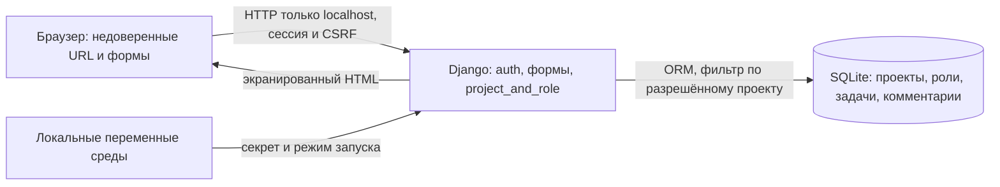

# Проект: TaskFlow, планируемый выпуск v1.0.0

Версия концепции для ЭК1, 04.10.2026. Разделы 1–5 заполнены по [текущим правилам курса](https://github.com/hse-rbpo-master-2026/course/tree/5ce5fdf4ba4bb32ac62d1b9c6728f3a6d8fa6884). В документе описаны границы нашего продукта, исходное состояние и план безопасной разработки. Выполненные проверки отделены от дальнейшего плана.

## 1. Паспорт проекта

| Поле | Значение |
| --- | --- |
| Команда | ЯвкаИБ |
| Участники | Бекетов Роман Александрович — [rbeketov](https://github.com/rbeketov); Кузьмин Ярослав Артёмович — [yarikTri](https://github.com/yarikTri) |
| Учебные адреса для ЭИОС | Требуется добавить перед подачей паспорта; в публичной версии пока не указаны |
| Продукт | TaskFlow: локальный веб-трекер проектов, задач и текстовых комментариев с ролями внутри проекта |
| Планируемый выпуск | `v1.0.0`: учебный локальный выпуск с обоснованным решением о допустимости использования |
| Исходное состояние продукта | [`baseline-mvp`](https://github.com/rbeketov/rbpo-yavkaib/tree/baseline-mvp), commit [`39cfbe71e5960ef8c4b7637d769444d34c94d260`](https://github.com/rbeketov/rbpo-yavkaib/commit/39cfbe71e5960ef8c4b7637d769444d34c94d260) |
| Комплект ЭК1 | Тег `ek1`; это комплект для оценивания, не продуктовый выпуск |
| Репозиторий | https://github.com/rbeketov/rbpo-yavkaib |

**Исходная версия.** В качестве baseline используем первый работающий MVP. До него в репозитории находились только документы; отдельной промышленной версии не было. Имеющиеся тесты входят в исходное состояние. Последующее улучшение будем оценивать относительно этой версии. Код продукта в комплекте ЭК1 совпадает с baseline; контрольные суммы приведены в [verification.json](evidence/ek1/verification.json). После baseline добавлены концепция, правила работы и CI.

### Контекст и пользователи

Наша команда состоит из двух студентов. TaskFlow предназначен для небольшой учебной команды; для демонстрации используем синтетические аккаунты. Основное требование к продукту: пользователи работают только с разрешёнными проектами, а наблюдатель не изменяет данные. Пользователь может владеть одним проектом и читать другой. Доступ администратора ОС к файлу SQLite находится вне этой модели.

Для будущего продуктового выпуска планируем совместное решение двух участников на основании результатов проверок (§4). Небольшой объём трекера и три роли позволяют сосредоточиться на контроле доступа и проверяемости выпуска.

| Действие | Владелец | Редактор | Наблюдатель | Вне проекта |
| --- | --- | --- | --- | --- |
| Читать проект, задачи и комментарии | Да | Да | Да | Нет |
| Создавать/изменять задачи, писать комментарии | Да | Да | Нет | Нет |
| Удалять задачу или проект | Да | Нет | Нет | Нет |
| Управлять участниками и их ролями | Да | Нет | Нет | Нет |

Любой аутентифицированный пользователь может создать свой проект. Владелец назначается сервером и не меняется через формы. Роли editor/viewer хранятся в Membership; owner — в Project. Отзыв членства действует со следующего запроса. Superuser не получает глобального доступа через веб-приложение.

### Границы

**Входит:** локальное создание demo-пользователей; вход/выход; создание и удаление проектов; управление составом владельцем; задачи с названием, описанием и статусом todo/doing/done; текстовые комментарии; серверное разграничение доступа; миграции, инструкции и воспроизводимые проверки.

**Не входит:** промышленный хостинг, реальная многопользовательская эксплуатация, регистрация и восстановление пароля, SSO, почта, мобильный клиент, SPA, вложения, уведомления, интеграции и внешнее API. Не исследуются производственная инфраструктура, нагрузка и защита от администратора ОС. Для показа используются только синтетические данные.

### Компоненты, взаимодействия и границы доверия

Стек: Python **3.12.14**, Django **5.2.17**, SQLite из Python, серверные HTML-шаблоны и локальный CSS; asgiref **3.12.1**, sqlparse **0.6.0**. Версии пакетов фиксируются в [requirements.txt](requirements.txt), схема данных — в [миграции](tracker/migrations/0001_initial.py).

1. **Браузер → сервер:** подмена URL/полей допустима как угроза. Сервер проверяет вход, членство и роль; ID объекта сам по себе права не даёт. Задача ищется внутри уже разрешённого проекта.
2. **Пользовательский текст → HTML:** Django экранирует названия, описания и комментарии. HTML пользователя не считается доверенным. Поля имеют ограничения длины.
3. **Сервер → данные:** запись через ORM и ограниченный набор полей формы. `owner`, `created_by`, `author`, `project` задаются сервером, а не принимаются из POST.
4. **Среда запуска → процесс:** секрет создаётся локально, не хранится в Git. SQLite и `.env` доступны доверенному оператору компьютера. `DEBUG=1` и HTTP используются только на loopback; production-проверка настроек не заменяет реального развёртывания.
5. **Поставка → окружение:** зависимости скачиваются с PyPI при установке; действия GitHub запускают CI. Во время работы приложения внешние сервисы не нужны.

### Активы и существенные риски

| ID | Актив и возможное нарушение | Значимость и граница | Направление проверки |
| --- | --- | --- | --- |
| R1 | Чужие проекты/задачи/комментарии читаются или меняются через подмену ID | Высокая: нарушено основное обещание изоляции, даже на синтетических данных | Серверная матрица прав, чужой project/task/membership ID |
| R2 | Редактор/наблюдатель меняет роли, владельца или сохраняет доступ после отзыва | Высокая: потеря контроля владельцем | Запретные POST, подмена полей, отзыв и понижение роли |
| R3 | CSRF либо скрипт в тексте вызывает действия от имени пользователя | Высокая при наличии рабочей сессии | Реальная CSRF-проверка, экранирование, безопасные методы |
| R4 | Проверен один код, а представлен другой; зависимости невозможно воспроизвести или не оценены их известные дефекты | Средняя для локального выпуска: результаты не обосновывают поставляемую версию | Зафиксированные версии, SHA-256, архив тега, анализ зависимостей |

Это гипотезы риска, а не заявления о найденных уязвимостях. Отсутствие ограничения частоты входа и защита локальных файлов — известные ограничения. Выход за localhost потребует пересмотра границ и блокирует применение текущего решения о локальном выпуске.

### Доступные материалы и ограничения

- [x] Исходный код, открытая Git-история и отдельный baseline.
- [x] Локальный запуск по [README](README.md), миграции и синтетические данные.
- [x] Зафиксированные зависимости и конфигурация через среду.
- [x] 27 автоматических тестов с подслучаями, сохранённый [отчёт](evidence/ek1/verification.json).
- [x] Возможность изменить код и повторить проверку.
- [x] Файл [CI](.github/workflows/ci.yml) в комплекте ЭК1; он запускает проверки. Обязательность статуса и branch protection не подтверждены.

**Недоступно/не исследовано:** промышленная среда, пользовательская статистика, внешние аудиты, закрытые обсуждения команды, история реальных релизов. Независимое воспроизведение партнёром пока не подтверждено.

**Конфиденциальность:** только синтетические аккаунты и тексты; `.env`, БД, cookie и пароли исключаются из публикации. Учебные адреса добавим при оформлении паспорта для ЭИОС с учётом требований к публичной и сдаваемой версии.

**Выполнимость:** один сервер и БД; готовые механизмы Django; небольшой набор ролей. В рамках курса достаточно провести независимую проверку значимых сценариев, интерпретировать результаты, внести одно полезное улучшение и повторить проверку. Искусственное внесение уязвимости не требуется.

## 2. Методологическая основа

**Основная рамка:** NIST SSDF **1.1**, NIST SP 800-218 (февраль 2022). Мы используем её для описания практик разработки и решения о выпуске: эти действия можно распределить между двумя людьми. Ограничиваем область выбранными ниже положениями и не заявляем соответствие всей рамке.

### Сравнение вариантов

| Источник и доступ | Назначение | Применимость и адаптация | Ограничение и решение |
| --- | --- | --- | --- |
| [NIST SSDF 1.1](https://nvlpubs.nist.gov/nistpubs/SpecialPublications/NIST.SP.800-218.pdf), открытый PDF | Практики безопасного SDLC | Требования, роли, защита кода, review, тесты, фиксация выпуска и реакция на дефекты | Не даёт готовых тест-кейсов или оценки зрелости. **Выбран основной**; используем 7 групп положений ниже |
| [OWASP SAMM 2](https://owaspsamm.org/model/), открытая модель | Оценка и развитие зрелости организации | Помогает обсуждать рост практик; роли и формальные уровни пришлось бы существенно сокращать | Два студента и новая кодовая база не дают достаточной истории для убедительной оценки зрелости. **Не выбран основным**; не проводим SAMM assessment |
| [OWASP ASVS 5.0.0](https://github.com/OWASP/ASVS/tree/v5.0.0), открытый стандарт | Технические требования к безопасности приложений | Источник требований к доступу, сессиям и выводу текста при уточнении §5 | Не определяет весь процесс и полномочия выпуска. **Дополнительный источник**; уровень ASVS и полное соответствие не заявляются |

### Адаптация SSDF

«Полностью» ниже означает применимость выбранного положения к нашим границам, а не завершённость исполнения. «Частично» — осознанное сокращение организационного масштаба. Статус фактического исполнения отдельно дан в §3.

| Положение SSDF 1.1 и смысл | Применимость и причина | Действие и исполнитель → проверяющий | Свидетельство и критерий | Упрощение/граница |
| --- | --- | --- | --- | --- |
| **PO.1.2** — определить и поддерживать требования безопасности | Полностью: нужны конкретные права R1–R3 | Автор изменения обновляет матрицу/сценарии → партнёр сверяет | Матрица §1 + тесты: каждое новое действие имеет разрешённый и запрещённый сценарий | Только локальный продукт; нет вымышленных договорных требований |
| **PO.2.1** — определить роли и ответственность SDLC | Полностью: иначе автор проверяет себя | Оба принимают порядок §4, в PR называют автора и второго проверяющего | Реальный review другого участника и запись решения; при недоступности второго выпуск ждёт | Нет выделенной службы ИБ; роли совмещаются, автор и reviewer одного изменения различаются |
| **PS.1.1** — минимальные права к коду/конфигурации | Частично: открытость кода допустима, целостность важна | Владелец репозитория контролирует write-доступ → партнёр сверяет доступную конфигурацию | Список лиц/прав без секретов; рабочие ветки и PR; токен CI только contents:read | Конфиденциальность открытого кода не нужна; административные настройки пока не исследованы |
| **PW.7.1–PW.7.2** — выбрать и провести review/анализ кода, документировать разбор | Полностью для изменяемого кода: R1–R3 и G1 | Автор отмечает затронутые проверки → партнёр читает разрешения, формы, запросы и отмечает решение | Review со ссылками на код, результатом воспроизведения и разобранными замечаниями | Небольшой checklist и ручной review; покупка SAST не обязательна |
| **PW.8.1–PW.8.2** — выбрать и выполнить проверки работающего кода | Частично: R1–R4 проверяем в локальной среде | Ведущий метода выполняет тест → партнёр повторяет значимый негативный сценарий | Команды, версии, commit/hash, результаты и предел вывода; тесты зелёные | Без нагрузочных/инфраструктурных тестов и заявления о полном penetration test |
| **PS.3.1** — сохранить выпуск и сведения о целостности | Частично: R4, G3 | Ответственный за комплект делает тег/архив → партнёр распаковывает и запускает | Тег, commit, SHA-256 архива, воспроизводимый запуск именно из архива | GitHub+ЭИОС вместо корпоративного хранилища; без подписанной цепочки происхождения |
| **RV.2.1–RV.2.2** — оценить риск дефекта и спланировать ответ | Частично: G2 и будущие сообщения | Ведущий по компоненту разбирает применимость → партнёр проверяет, оба решают выпуск | Карточка: факт/ложное срабатывание/неприменимо/нужна проверка, причина, решение и повторный тест | Нет круглосуточного SLA; сроки учебные, реакция описана в §4 |

Подробности, не имеющие объекта в текущих границах (например, проверка мобильного клиента или управление подрядчиками, которых нет), не включены. При расширении продукта применимость пересматривается, а не автоматически переносится на новую среду.

## 3. Текущее состояние

### Основания и пределы наблюдения

Наблюдение выполнено 04.10.2026 по публичной Git-истории, исходникам и локальным запускам. Реестр — [evidence/ek1/README.md](evidence/ek1/README.md), машинный отчёт — [verification.json](evidence/ek1/verification.json), ограниченная выборка GitHub — [repository-observation.json](evidence/ek1/repository-observation.json).

| Объект | Что наблюдается | Что это не доказывает |
| --- | --- | --- |
| Два коммита до MVP | Паспорт и структура репозитория; приложения ещё не было | Нельзя восстановить закрытые обсуждения и устные проверки |
| `baseline-mvp` | Исходный код, миграция, инструкции и тесты | Наличие исходников и тестов не подтверждает независимый review |
| Серверные handlers и тесты | Проверяется членство/роль, задачи ограничены проектом; владельца/автора нельзя задать формой | Конечная выборка тестов не покрывает все сочетания и будущие изменения |
| Локальный verifier | 5 проверок успешны; 27 тестов с подслучаями успешны; версии/хеши сохранены | `pip check` не ищет CVE; `check --deploy` не проверяет реальный HTTPS/инфраструктуру |
| Браузерная проверка | Вход владельца, создание задачи, вход наблюдателя и режим чтения | Скриншот подтверждает интерфейс, а серверный запрет подтверждается тестами |
| Публичный API до нового комплекта | 0 PR и 0 Actions runs в ограниченной выборке | Это не доказательство отсутствия устных reviews; не описывает последующие запуски CI |
| Комплект ЭК1 после baseline | Добавлены концепция, workflow и правила дальнейшей работы | Наличие правил/CI-файла не означает, что два человека уже следовали им или настроен обязательный gate |

**Организация работы:** общий репозиторий принадлежит rbeketov; приглашение yarikTri отправлено. Его текущий статус и настройки доступа нужно сверить перед совместной работой.

**Требует уточнения:** branch protection и состав write-доступа, окончательное распределение задач, учебные адреса и точный дедлайн ЭИОС. Независимый review и воспроизведение вторым участником пока не зафиксированы. Порядок §4 и методы §5 — план дальнейшей работы.

### Существенные разрывы

**G1. Нет сохранённой независимой проверки MVP — высокий приоритет.**
Объект — модель ролей и изменения доступа; риск R1/R2. Тесты создавались в процессе реализации, без отдельной независимой проверки. Поэтому одна и та же ошибка может оказаться и в реализации, и в ожидаемом результате теста. В рассмотренных коммитах/PR нет проверяемого review партнёра. Это разрыв в основании решения, а не доказательство уязвимости или отсутствия любого чтения кода. Для закрытия: партнёр объясняет сценарий запрета, проверяет handler и повторяет его, оставляет review с конкретными ссылками. Целевое правило: GATE-M в §4.

**G2. Не оценена применимость известных дефектов зависимостей — средний приоритет.**
Версии зафиксированы, `pip check` проходит, но этот инструмент не выполняет аудит CVE. По рассмотренным материалам отчёта поиска и триажа нет. Не утверждается, что зависимость уязвима. R4 существенен, поскольку Django обслуживает вход и HTTP. Для закрытия: получить актуальный отчёт по точным версиям, разобрать применимость и сохранить решение, включая случай «ничего не найдено». Целевое правило: GATE-R, метод М3.

**G3. Воспроизводимость ещё не подтверждена вторым участником — средний приоритет.**
Автоматические проверки и упаковку можно выполнить на машине автора; это не подтверждает запуск в окружении партнёра и понимание параметров. Нет истории нескольких реально проверенных выпусков. R4: ошибка инструкции либо сбор не той версии может обесценить выводы. Для закрытия: второй участник распаковывает архив тега в чистый каталог, повторяет установку/проверки, сверяет commit и SHA-256. Проверенная упаковка частично снижает риск, но не заменяет независимый запуск. Целевое правило: GATE-R.

Отсутствие отдельного отдела ИБ, дорогих сканеров или большого числа документов не считается самостоятельным дефектом.

## 4. Целевой Secure SDLC

**Статус:** целевой порядок работы нашей пары. На ЭК1 представляем концепцию; до продуктового `v1.0.0` планируем выполнить независимый review и принять совместное решение о выпуске.

### Роли и полномочия

- **Роман Бекетов (rbeketov), планируемый ведущий М1/М3:** доступ, сессии, зависимости и сборка комплекта. Партнёр проверяет существенную часть результата.
- **Ярослав Кузьмин (yarikTri), планируемый ведущий М2:** задачи/комментарии, обработка ввода, пользовательские сценарии. rbeketov проверяет существенную часть результата.
- **Автор изменения:** пишет код/документ и собирает проверки; **reviewer:** другой участник, а не автор или ИИ. Для изменений партнёра роли меняются.
- **Оба:** принимают остаточный риск и решение о продуктовом выпуске. Административное право владельца нажать merge/tag не заменяет основание решения.

Это план распределения работы; окончательно согласуем его перед апробацией методов. Взаимную проверку выполняет второй участник, а её результат сохраняется в review.

### Поток и контрольные точки

| Шаг / gate | Обязательное действие | Кто действует и проверяет | Сохраняемый результат | Условие перехода и отказа |
| --- | --- | --- | --- | --- |
| **GATE-S: границы** | Перед новым поведением указать затронутую роль, объект, риск, негативный сценарий | Автор → партнёр | Краткое описание в PR/issue, обновление §1 при смене границ | Нет понятного права/объекта — уточнить до реализации; новый внешний сервис/данные требуют пересмотра рисков |
| Реализация | Маленькая ветка, ограниченные поля, проверка прав на сервере, тест изменения | Автор | Diff, тесты, команды | Ошибка исправляется в ветке |
| **GATE-M: включение** | Verifier проходит; другой участник читает существенный код и повторяет хотя бы один запретный сценарий | Автор запускает → партнёр оставляет review | CI run для commit и review со ссылками/результатами | Красный/отсутствующий результат, неразобранное замечание или нет reviewer — merge откладывается |
| **GATE-R: выпуск** | Проверки commit, триаж значимых результатов, установка из архива, условия использования | Ведущий комплекта → партнёр воспроизводит; оба решают | Запись решения с рисками, tag/commit, checksum, отчёты | Непроверенная изоляция/права, применимая критическая проблема, секреты, неизвестная версия или нет второго решения — выпуск отложить |
| После выпуска | Принять сообщение, оценить применимость и охват, подготовить исправление | Ведущий компонента → партнёр, оба пересматривают решение | Карточка дефекта, исправление, повторный тест и новый тег | Старый тег не переставлять; опасную версию прекратить рекомендовать |

`CONTRIBUTING.md` реализует краткую памятку этих действий. CI запускает проверки, но обязательность статуса в настройках GitHub не подтверждена. Пока техническое принуждение не установлено, gate является предлагаемым правилом пары, а не гарантией платформы. Начальная подготовка непосредственно в `main` не выдаётся за прохождение будущего PR-процесса.

### Обязательный минимум и проверки по риску

**Для каждого продуктового выпуска:** неизменяемая идентификация версии; явная область использования; проверка ролей/изоляции и входа; отсутствие секретов в поставке; версии зависимостей и разбор результатов; независимый review; запуск из архива; решение обоих участников. При изменении только текста документа выполняется проверка смысла и ссылок, без бессмысленного повторения всех технических методов.

**По триггеру:** изменение доступа — вся матрица и отзыв ролей; новый ввод/вывод — XSS, длины, поля и CSRF; обновление пакетов — повтор М3 и регрессия; изменение конфигурации — проверка параметров/запуска; внешняя сеть, реальные данные, вложения или регистрация — пересмотр границ и дополнительный метод до выпуска. Сейчас публичный деплой не разрешён областью проекта.

### Исключения, принятие риска и эскалация

Некритическое отклонение оформляется одной карточкой: затронутая версия, требование, факт, влияние, компенсирующая мера, исполнитель, срок (до следующего выпуска, но не дольше семи дней) и явное согласие обоих. По окончании срока исключение закрывают исправлением и повторной проверкой либо выпуск откладывают; молчание не означает продление.

Нарушение изоляции/полномочий, опубликованный секрет, неустановленная версия, отсутствие второго проверяющего или непройденные базовые проверки не принимаются как исключение для `v1.0.0`. При недоступности партнёра автор готовит изменения и ждёт; самоодобрение и замена review ответом ИИ не допускаются. При споре сохраняют обе позиции, консультируются с преподавателем о границах курса и откладывают выпуск до общего обоснованного решения. Преподавателю не приписывается роль оператора продукта или автоматическое принятие риска.

После сообщения о возможной проблеме ведущий выполняет предварительный разбор в течение двух учебных дней; при риске доступа/секретов сначала прекращается распространение затронутой демонстрационной версии. Публичная карточка не должна содержать реальные секреты или данные. Затем — воспроизведение, решение о применимости, исправление, независимый review, регрессия, новый тег. Это целевой порядок, а не обещание круглосуточной поддержки.

### План до ЭК2

| Период | Результат и критерий завершения | Предлагаемый ответственный / оценка |
| --- | --- | --- |
| После ЭК1 и Л6–Л8 | Учесть замечания, подтвердить разделение, уточнить М1–М3 и версии средств | Оба; 1–2 совместных часа |
| С7–С8 | М1: независимые негативные сценарии; М2: ввод/вывод и CSRF; обмен review | Каждый ведущий 3–4 часа, партнёр 1–2 часа |
| С8–С9 | М3, триаж; одно полезное улучшение по фактам и повторный тест | rbeketov ведёт М3; улучшение распределяется по компоненту, 3–5 часов |
| До срока ЭК2 | Решение о выпуске, метрики, записка, личные страницы; архив проверен вторым участником | Оба; 2–3 часа |

Оценки времени — план, не табель выполненной работы. При нехватке времени сокращается число дополнительных методов и функций; независимый review и основания решения не исключаются.

## 5. Технологический профиль

**Предварительный план ЭК1.** Уточнить после Л6–Л8. Нет обязательства применить конкретный сканер или заявить полноценный аудит до изучения методов. Проверки, уже включённые в MVP, — доступная исходная опора, а не завершённая апробация обоими участниками.

### М1. Проверка серверного разграничения доступа

**Риски/цель:** R1/R2; подтвердить разрешения и отказы для всех трёх ролей и постороннего.

**Область:** все handlers [tracker/views.py](tracker/views.py), [permissions.py](tracker/permissions.py), отзыв/понижение роли, чужие ID, подмена автора/владельца, отсутствие обхода superuser.

**Этап:** требования → тесты при изменении → GATE-M/GATE-R.

**Способ:** Django TestCase/Client 5.2.17 и ручное чтение кода; [имеющиеся тесты](tracker/tests.py) доработать по независимым сценариям.

**Планируемый ведущий:** Роман Бекетов (rbeketov).

**Проверка партнёром:** yarikTri выбирает сценарий из матрицы без копирования готового теста, повторяет запрос, проверяет ответ и отсутствие изменения БД, затем оставляет review.

**Свидетельства:** точный commit, таблица входных условий/ожидаемых прав/фактических результатов, команды и существенный вывод теста, review.

**Ограничения:** не проверяет доверенного администратора БД, все конкурентные гонки или инфраструктуру; 403/404 без проверки состояния БД недостаточно.

### М2. Ввод, вывод и сессионные действия

**Риск/цель:** R3; текст остаётся текстом, запрос без CSRF-токена не меняет состояние, разрешённый сценарий продолжает работать.

**Область:** проекты/задачи/комментарии, серверные формы/шаблоны, вход/выход, пределы длины, GET без изменений.

**Этап:** разработка и review, GATE-M; регрессия перед GATE-R.

**Способ:** Django Client с `enforce_csrf_checks=True`, тесты экранирования и границ, ручной браузер. По ASVS 5.0.0 уточнить выбранные требования и ссылки после лекций; уровень соответствия пока не заявлен.

**Планируемый ведущий:** Ярослав Кузьмин (yarikTri).

**Проверка партнёром:** rbeketov повторяет отклонённый запрос без токена и успешный с токеном; проверяет опасный текст в DOM и факт отсутствия исполнения в браузере.

**Свидетельства:** пары положительных/отрицательных случаев, commit, вывод, только синтетические payload, небольшой скриншот при необходимости и review.

**Ограничения:** не полноценный XSS/DAST-аудит; конечный набор строк не покрывает все браузерные контексты; CSRF не защищает от уже исполняющегося XSS.

### М3. Зависимости, конфигурация и воспроизводимость поставки

**Риск/цель:** R4, G2/G3; знать состав и пределы проверенной версии, отдельно оценить известные дефекты.

**Область:** requirements, настройки Django, bootstrap, workflow, архив тега.

**Этап:** обновление зависимостей и GATE-R.

**Способ:** существующий verifier; предварительный кандидат для CVE — `pip-audit` (версию зафиксировать при выборе после Л6–Л8); установка в чистую `.venv`, миграции/seed, `git archive`, SHA-256. Факт выполнения CVE-аудита пока не заявлен.

**Планируемый ведущий:** Роман Бекетов (rbeketov).

**Проверка партнёром:** yarikTri воспроизводит архив в своём каталоге/окружении и проверяет хотя бы одно решение триажа по первичному описанию проблемы, либо границы вывода «ничего не найдено».

**Свидетельства:** версии средства и базы/дата запроса, входной requirements, существенный отчёт, применимость, commit/checksum, лог установки/запуска и review.

**Ограничения:** CVE-база неполна; отсутствие находок не доказывает безопасность; pins не являются hash-lock или полной защитой цепочки поставки; локальная проверка настроек не подтверждает реальный production.

## 6. Практическая апробация

Для ЭК1 не требуется. Сейчас выполнены только инженерные проверки исходного MVP из [реестра свидетельств](evidence/ek1/README.md). Полноценную апробацию М1–М3 с независимым повторением и окончательными версиями средств предстоит выполнить после профильных занятий.

## 7. Результаты и триаж

Для ЭК1 не требуется. Проверки baseline успешны в указанной области; подтверждённых уязвимостей этими проверками не установлено. CVE-аудит и его триаж не выполнялись. Дальнейшие результаты будут разделяться на подтверждённые, ложные срабатывания, неприменимые и требующие проверки с основанием каждого решения.

## 8. Улучшение и повторная проверка

Для ЭК1 не требуется. Создание baseline не считается сравнением «до/после», а добавление workflow — ещё не подтверждение полезного исправления обоими участниками. Улучшение выбрать по будущим результатам: например, новый независимый регрессионный сценарий или устранение подтверждённого дефекта. Сохранить изменение, исходный результат, повторную команду и реальный вклад каждого.

## 9. Решение о выпуске

Предварительно **отложить продуктовый v1.0.0** до независимого review, уточнения зависимостей и выполнения GATE-R. Локальный MVP доступен для учебного исследования. Тег `ek1` фиксирует комплект концепции, а не положительное решение о продуктовом выпуске. Публичная эксплуатация исключена границами; неизвестные риски не объявляются принятыми обоими участниками.

## 10. Метрики и программа развития

К ЭК2: доля изменённых чувствительных сценариев с независимой проверкой; число неразобранных существенных результатов; воспроизводимость архива вторым участником. Сейчас значения не подменяются искусственными процентами. Ближайшая программа — §4; план на 6–12 месяцев сформировать после реальной апробации, без обещаний промышленной поддержки.

## 11. Управленческая записка

Отдельная итоговая записка к ЭК2 ещё не подготовлена. Текущее основание: доступный локальный трекер и сформулированная концепция; есть автоматические проверки исходного кода, но нет независимого review и полного основания выпуска. Следующий приоритет — закрыть G1–G3 в пределах учебной пары.

## 12. Использование генеративного ИИ

**Инструмент:** OpenAI Codex, модель семейства GPT-6.

**Применение:** подготовка основной реализации MVP, автоматических тестов, скриптов, CI и текстов паспорта, концепции и памятки защиты.

**Данные:** публичные материалы курса, сведения об участниках, исходники учебного проекта и синтетические сценарии. Реальные пароли, рабочие базы и закрытый корпоративный код не использовались.

**Проверка результата:** выполнены автоматические тесты и браузерные сценарии, сверены требования курса, сохранены результаты с хешами исходников. Эти проверки проводились с помощью Codex; независимая взаимная проверка участниками запланирована в §4–5. Ответственность за представленный проект и объяснение его решений остаётся у команды.
